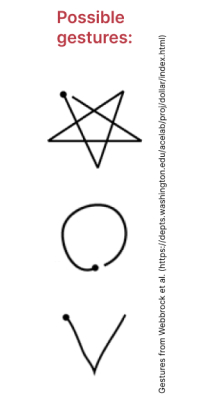

# Task 1

For documentation of our developing and implementation process as well as usage guide, read [documentation](documentation.md).

# Task 2

Run program:

- start `touch-input.py` (optionals params: *video_id* of ERWIN (default: 6), *receiver ip* (default localhost))
- calibrate by pressing `s` when touch-input window opens
- start `multitouch-demo.py` (optional params: *maximum of detected fingers* (default: 5))

Controls:

- hover events are displayed by circles (heidenelke)
- touch events are displayed by circles (green)
- to move an image: drag it with your **touching** finger
- to rotate an image: place two **touching** fingers on the image and change a finger's angle towards image center
- to scale an image: place two **touching** fingers on the image and change the distance between a finger and the image center

# Task 3

Prepare `applications.txt`:

* the text file is structured as following: `gesture, path_to_application`
* the path to application depends on the OS:
  * Linux: `/usr/bin/firefox ` || somehow with Ubunutu `firefox` was enough
  * Windows: absolute path to the .exe-file

Run program:

- start `touch-input.py` (optionals params: *video_id* of ERWIN (default: 6), *receiver ip* (default localhost))
- calibrate by pressing `s` when touch-input window opens
- start `application-launcher.py` with additional parameter `--input `
  - `0` for input with ERWIN (draw gestures with your finger on the box)
  - `1` for input with mouse (draw gestures with mouse drag in the pyglet window)
  - example: `application-launcer.py --input 1`
- possible gestures

