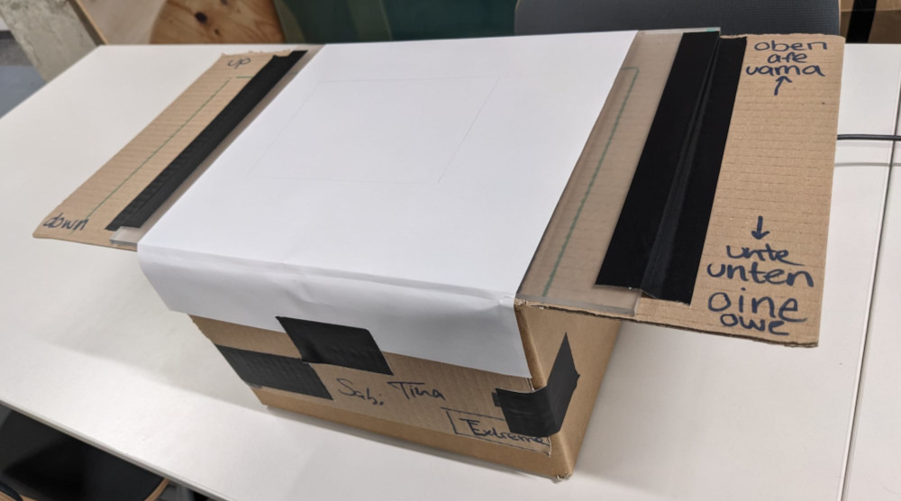
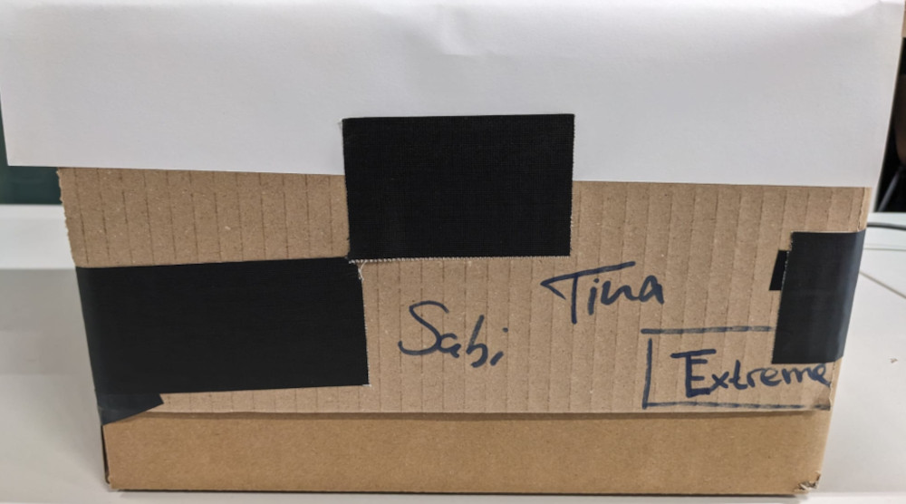
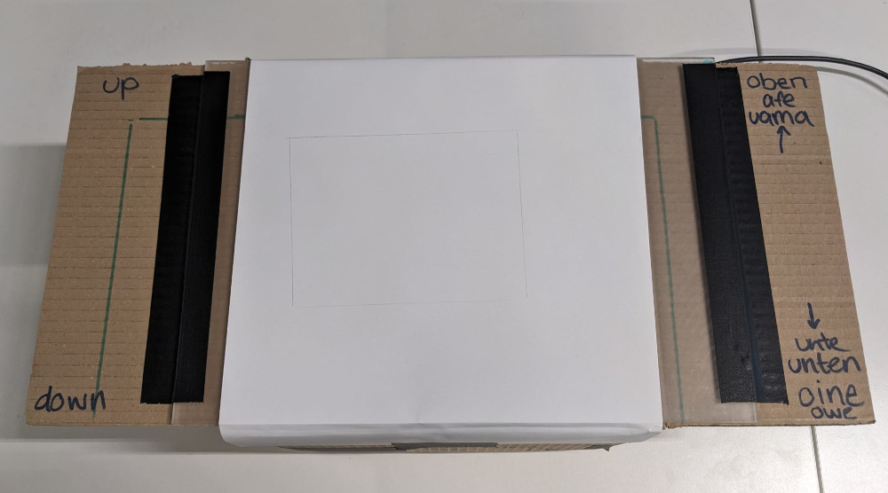
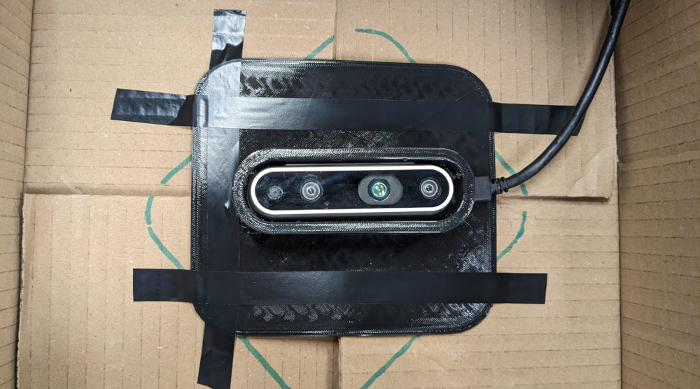

# Documentation

**Team Extreme: Tina Emmert & Sabrina Hößl**

Things used for this assignment:

- cardboard box
- Intel RealSense D435
- Acrylic Plate (milky)
- Paper (DIN-A3)
- 3D printed camera holder

## Building the box

We build the box with the bottom closed, top opend. One of the flaps of the box is taped to the side and the other flaps are used to hold the acrylic plate in place. To make sure the plate doesn't move accidentally we taped it onto the box. On top of the plate we taped paper as a diffusor. A drawn rectangle shows what part of the paper is captured by the camera. Since normal tape couldn't hold the camera enough inside the box, we decided to quickly 3D print a camera holder. This holder itself was taken from Thingiverse ([Thing: 4639450](https://www.thingiverse.com/thing:4639450) by rogwabbit) and redesigned in Blender (only the camera "case" remained with a custom plate added). It's made out of TPU filament and taped to the bottom of the box. We also cut a hole in the box to put the USB cable through.

For further design we decided to show how fascinating the "Oberpfälzer"-dialect is by writing the words "up" and "down" in our own dialects on it. To make sure everyone understands where "up" and "down" of the box is, we also wrote it in german and english. Of course we also signed the box with our autographs and the very good designed team logo.

## Code

We tried out two approaches:

1. CNN
2. Threshholds

In the end we decided to go with the second plan, but had already put in lot of work in the CNN plan. Because of this we want to explain shortly what we did, so we didn't do it completely unnecessary.
We captured 7783 samples (=photos of fingers) for trainingsdata, labeled with either "hover" or "touch". For this we detected the bounding box of the fingers and added padding to it, so the box for capturing was always the same size. We trained a CNN with this data, which we called ERWIN ("ein richtig wildes input netzwerk"). With progress in code and assignment tasks the output was not good enough, so we had so retire ERWIN as the recognizer, but to honor him we called the box ERWIN and do the distinction with thresholds.

For this we transform the frame to greyscale picture and perform a binary threshold. Detected objects (black) are drawn with a contour, which contained area we further analyse to determine what objects are being tracked (e.g. fingers) and which not (e.g. palms).

## Usage Guide

1. Set up the Box
2. Connect the camera
3. Check if camera ID is the same as in the code
4. Turn on some lights (please don't be a Gollum)
5. Start `touch-input.py` (optional: input params video_id and receiver ip)
6. Press `s` to calibrate the camera to the light (do not place anything on the touchscreen yet)
7. Hover by light touching the surface with your fingertip, Touch by stronger touching the surface and bending the finger a bit
8. Start whatever application you want
9. Give us many points
